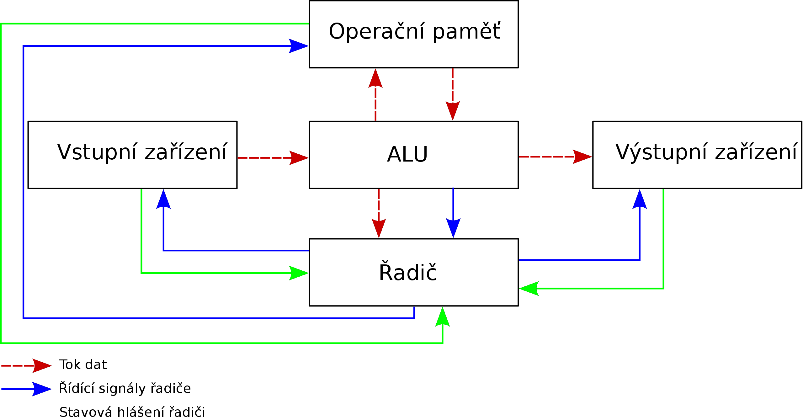
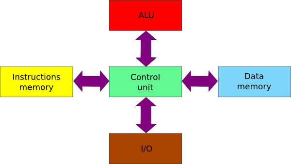

# Architektury počítačů

## Von Neumannovo schéma

Program je psán v nějaké instrukční sadě.

Protože je program uložen v paměti, je možné ho za běhu modifikovat nebo jinak využívat => s instrukcemi lze zacházet jako s daty. Myšlenkou bylo umožnit „samo-programování" počítačů, běžně využíváno při ladění programů nebo v překladačích.

Instrukce jsou zpracovávány sekvenčné, ale program je zpracován pouze jeden v daný okamžik.

### John Ludwig Von Neumann

- americký matematik židovského původu
- v 17 letech => publikace první vědecké práce
- ve 22 letech => asistující profesor na Berlínské univerzitě
- spolutvůrce Teorie her
  - použití: ekonomika a jakékoliv další obory s projevy chaosu
- podílel se na konstrukci několika nejznámějších počítačů (například ENIAC)
- tvůrce operační teorie kvantové mechaniky (Von Neumannova algebra)
- spolupodílel se na konstrukci první jaderné bomby
- 1949 vytvořena von Neumannova matematická pravidla pro konstrukci robotů
  - budou se sami zdokonalovat a reprodukovat
  - možnosti využití nastávají až nyní
  - NASA je chce využít pro konstrukci robotů pro vesmír
- 1945 navrhl schéma samočinného počítače

### Schéma

- **operační pamět**
  - uchovávání programu, dat, mezivýsledků, výsledků výpočtů
- **řadič**
  - řídící jednotka, řídí činnost všech částí počítače pomocí řídícího signálu
- **ALU**
  - aritmetickologická jednotka, provádí veškeré aritmetické výpočty a logické operace
- **Vstup** (vstupní zařízení)
  - zařízení pro vstup programů a dat
- **Výstup** (výstupní zařízení)
  - zařízení pro výstup programů a dat
- **myšlenka**
  - umístění programu a dat do téže paměti (Operační)
  - program spustíme, pak je podle tohoto programu vytvořen proces

### Výhody

- rozdělení paměti pro kód a data určuje programátor
- řídící jednotka procesoru přistupuje do paměti pro data i pro instrukce jednotným způsobem
- jedna sběrnice => jednodušší výroba

### Nevýhody

- společné uložení dat a kódu může mít při chybě za následek přepsání vlastního programu
- jediná sběrnice tvoří úzké místo

### Použití (součastnost)

- Assembler
- překladač programovacího jazyka
- většina dnešních počítačů téměř odpovídá von Neumannově architektuře
  - odlišnosti
    - v jednom počítači může být více než jeden procesor, případně procesor s více jádry
    - v jednom okamžiku může být spuštěno více programů
    - existují I / O zařízení, která jsou Vstupně-výstupní
    - není nutné mít program v operační paměti celý, je možné zavést do paměti jen potřebnou část
    - virtuální paměť
- **problém** => hůře se implementuje paralelismus a vícerozměrná data

## Harvardská architektura

- paměť programu je oddělena od paměti dat
- oddělené sběrnice
- řízení procesoru je odděleno od řízení vstupních a výstupních jednotek (nejsou napojeny přímo na ALU)

### Výhody

- program nemůže přepsat sám sebe
- paměti mohou být vyrobeny odlišnými technologiemi
- každá paměť může mít jinou velikost nejmenší adresovací jednotky
- dvě sběrnice umožňují jednoduchý paralelizmus, kdy lze přistupovat pro instrukce i data současně

### Nevýhody

- dvě sběrnice kladou vyšší nároky na vývoj řídící jednotky procesoru a zvyšují i náklady na výrobu výsledného počítače
- nevyužitou část paměti dat nelze použít pro program a obráceně

### Modifikovaná Harvardská architektura

- data a paměť oddělena, ale využívají společná data a adresovou sběrnici
- snadnější práce mezi rozdělenými paměťmi
- zacházení s instrukcemi jako s daty
- Intel 8051, signálové počítače (DSP), audio/video stanice
