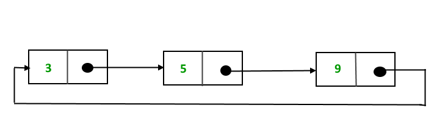
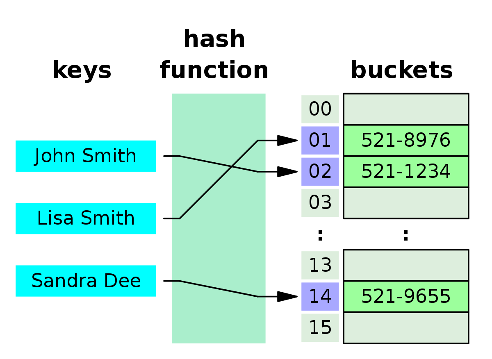

# Datové struktury

Každá data jsou reprezentována datovými typy. Ty můžeme také skládat do struktur (třídy,..).

Každá datová struktura má své operace, které mají svojí časovou náročnost (Big O notation).

## Array

- data jsou poskládány za sebou v paměti
  ```
  Pamět
  ╭───┬───┬───┬───┬───┬───┬───┬───┬───╮
  │ 1 │ 2 │ 3 │ 4 │ 5 │ 6 │ 7 │ 8 │ 9 │
  ╰───┴───┴───┴───┴───┴───┴───┴───┴───╯
  ```
- dělí se na statické a dynamické
  - statické mají pevně dannou velikost
  - dynamické mají proměnlivý počet prvků

## Queue

- je to dynamický array
- vkládá se do něho na principu FIFO (First In, First Out)
  ```
                    =>
  ╭───┬───┬───┬───┬───┬───┬───┬───┬───╮
  │ 9 │ 8 │ 7 │ 6 │ 5 │ 4 │ 3 │ 2 │ 1 │
  ╰───┴───┴───┴───┴───┴───┴───┴───┴───╯
    ^ - IN                          ^ - OUT
  ```

## Stack

- je to dynamický array
- vkládá se do něho na principu LIFO (Last In, First Out)
  ```
  ╭───╮
  │ 6 │  < - IN/OUT
  ├───┤
  │ 5 │
  ├───┤
  │ 4 │
  ├───┤
  │ 3 │
  ├───┤
  │ 2 │
  ├───┤
  │ 1 │
  ╰───╯
  ```

## Linked List

- je to dat. struk., která má předem neznámou délku
- tato struktura se skládá z uzlů (Nodes)
  - uzel vždy má hodnotu a adresu další hodnoty
    
  - první uzel se nazývá Head a poslední Tail
- lze vkládat 3 způsoby
  - před Head
    - nejjednodušší
    - vytvoříme uzel, který bude ukazovat na Head
  - za Tail
    - vytvoříme uzel, na který bude ukazovat Tail
  - mezi 2 uzly
    - nejsložitější
    - postup
      1. vytvoříme uzel, který bude ukazovat na určitý uzel (A)
      2. uzel který je před uzlem (A), tak bude muset nyní ukazovat na náš nový uzel
         
- dělí se
  - single linked list (jednosměrně spojový seznam)
    - uzel ukazuje na další uzel
  - doubly linked list (obousměrně spojový seznam)
    - uzel ukazuje na další i předchozí uzel
  - circular linked list (kruhový spojový seznam)
    - poslední uzel ukazuje na první uzel
      

## Tree (Strom)

- slouží k uchování hierarchicky uspořádaných dat (např. složky a soubory)
- každý strom má Root (kořen), což je uzel
- každý uzel může mít větve na kterých jsou další uzly, pokud uzel nemá žádné větve, tak se nazývá list (Leaf)
- uzel, který není Root ani Leaf se nazívá internal Node (vnitřní uzel)
- existuje mnoho typů stromů
  - binární strom (uzel má vždy nejvíc 2 uzly)
  - binární vyhledávací strom (stejné jako bin. strom, ale levý uzel má vždy menší hodnotu než pravý)
- můžeme u nich měřit jejich hloubku (kolik uzlů je mezi Root a nejvzdálenějším Leaf)

```
Velikost tohoto stromu je 3 (A -> C -> E je nejdelší cesta k Leaf)
            A
           ╱ ╲
          B   C
             ╱ ╲
            D   E
```

## Graph (Graf)

- je složen z uzlů (node, vertex), hran (edge, spojuje uzly) a jejich vzájemných incidencí (adjacency)
- 2 typy
  - neorientovaný graf - hrany nerozlišují směr
  - orientovaný graf - hrany mají určen směr od počátečního do koncového uzlu
    

## Hash table

- používá se k sestavování asociativních polí, které za pomoci klíče (key) a správné hashovací funkce (hash function) umožňují indexování
- jde o metodu, která řádově snižuje asymptotickou složitost vyhledávání až na logaritmickou úroveň
- indexování je hojně používáno například v databázích, kde urychluje vyhledávání
  

## Použití

| Název       | Využití                                                         |
| ----------- | --------------------------------------------------------------- |
| Array       | kontakty v mobilu, vytváření blok prvku pro ostatní dat. struk. |
| Stack       | undo a redo                                                     |
| Queue       | task scheduling, call center, vyvolávání lístků s pořadím       |
| Linked list | undo a redo, předcházení kolizí v hash map                      |
| Tree        | file system                                                     |
| Graph       | nejkratší možná vzdálenost z bodu A do bodu B                   |

## Náročnost operací


