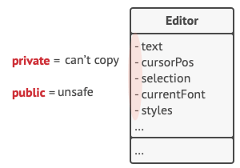
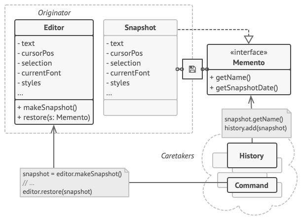
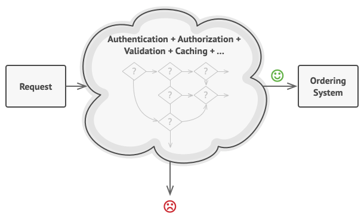

# Behavioral patterns

## Memento

Umožňuje nám vrátit (undo) předchozí stav i bez přístupu k implementaci objektu. V podstatě je to takový snapshot.

Příkladem může být undo v editoru.

**Problém:**

**Řešení:**

## Observer

Umožňuje informovat objekty, které chtějí být informovány (subscribed), o provedení nějaké akce.

Tento pattern můžeme znát také pod názvy Event-Subscriber nebo Listener.

**Problém**:

- čekání na nový produkt
- buď posíláme informaci nikomu nebo všem zákazníkům

**Řešení**:

- vytvoření objektu, který bude obsahovat všechny odběratele

## Chain of Responsibility

Umožňuje předávat požadavky řetězci zpracovatelů (handlers). Zpracovatel musí buď požadavek zpracovat nebo poslat dalšímu zpracovateli.

**Problém**:

- vyřešení požadavku na objednávací systém

**Řešení**:

- vytvoření řetězce zpracovatelů

