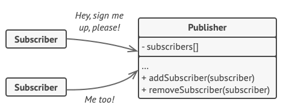

# Behavioral patterns

## Memento

- umožňuje se vrátit k předchozímu stavu (undo)
- **Problém**:
  - undo v editoru
  - 
- **Řešení**:
  - vytvoření snapshot
  - 

## Observer

- _znám jako Event-Subscriber nebo Listener_
- odebírací mechanismus (subscribe)
- umožňuje informovat objekty, které objekt odebírají, že se stala akce
- **Problém**:
  - čekání na nový produkt
  - buď posíláme informaci nikomu nebo všem zákazníkům
  - 
- **Řešení**:

  - vytvoření objektu, který bude obsahovat všechny odběratele
  - 

## Chain of Responsibility

- umožňuje předávat požadavky řetězci zpracovatelů (handlers)
  - každý zpracovatel musí buď požadavek zpracovat nebo poslat dalšímu zpracovateli
  - 
- **Problém**:
  - vyřešení požadavku na objednávací systém
  - 
- **Řešení**:
  - vytvoření řetězce zpracovatelů
  - 
