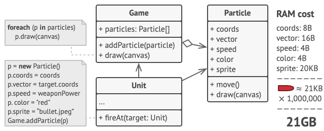

# Structural patterns

## Proxy

Zástupný objekt za originální objekt. Vykonává akce předtím, než se požadavek dostane k původnímu objektu nebo poté, co se k němu dostane.

```php
  interface Subject
  {
      public function request(): void;
  }

  // Objekt
  class RealSubject implements Subject
  {
      public function request(): void
      {
          echo "RealSubject: Handling request.\n";
      }
  }

  // Proxy
  class Proxy implements Subject
  {
      private $realSubject;

      public function __construct(RealSubject $realSubject)
      {
          $this->realSubject = $realSubject;
      }

      public function request(): void
      {
          if ($this->checkAccess()) {
              $this->realSubject->request();
              $this->logAccess();
          }
      }

      // Akce před
      private function checkAccess(): bool
      {
          echo "Proxy: Checking access prior to firing a real request.\n";
          return true;
      }

      // Akce po
      private function logAccess(): void
      {
          echo "Proxy: Logging the time of request.\n";
      }
  }

  function clientCode(Subject $subject)
  {
      // ...

      $subject->request();

      // ...
  }

  $realSubject = new RealSubject();
  clientCode($realSubject);

  // vs
  $proxy = new Proxy(new RealSubject());
  clientCode($proxy);
```

## Adapter

Funguje jako takové lepidlo mezi třídami, které mezi sebou nejsou kompatibilní. Výhodou je, že nemusíme modifikovat kód existující třídy.

V podstatě stejný princip jako u adaptéru např. z HDMI na USB C.


## Flyweight

Optimálnější využití RAM díky sdílení částí dat mezi vícero objekty místo nechání všech dat v každém objektu.

Původní návrh:



Zoptimalizovaný kód s pomocí vzoru flyweight. Sdílíme instanci třídy `Particle`:


